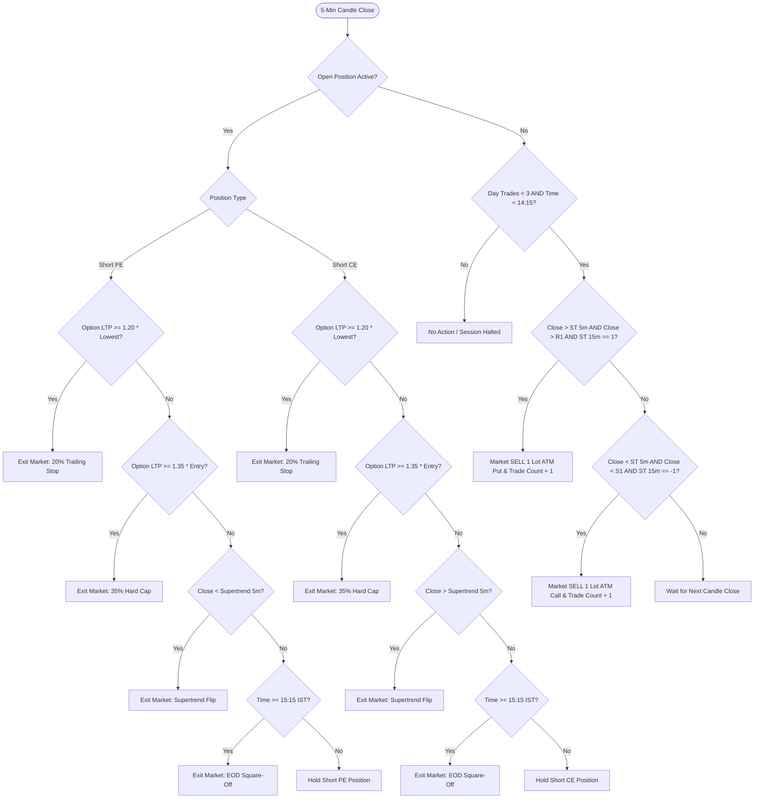

# Project TRISHUL: NIFTY 50 Intraday Options Selling Engine
**Architecture**: 3-Pillar Dual Momentum & Floor Pivots + Dynamic 20% Trailing Safety Net  
**Segment**: NSE / NFO Weekly Options (Intraday MIS)  
**Implementation**: [`nifty_options_supertrend_pivots.py`](file:///Users/hus9/AI/EngineI/nifty_options_supertrend_pivots.py)  
**Executive Presentation (PDF)**: [`out/TRISHUL_Strategy_Proposal.pdf`](file:///Users/hus9/AI/EngineI/out/TRISHUL_Strategy_Proposal.pdf)  
**Interactive Dashboard**: [out/nifty_options_dashboard.html](file:///Users/hus9/AI/EngineI/out/nifty_options_dashboard.html)


---

## 1. Executive Summary & Strategy Thesis

The **NIFTY Options Intraday Selling Strategy** is a quantitative, rule-based algorithmic trading framework designed to exploit **intraday theta (time) decay** in NIFTY 50 weekly options while strictly trading in the direction of confirmed intraday momentum.

### The Quantitative Edge
1. **Asymmetric Theta Capture**: In weekly index options, extrinsic value decays rapidly throughout the trading day, especially between 09:30 IST and 15:15 IST.
2. **Double Trend Confirmation**: Rather than selling strangles or naked options indiscriminately, the system only enters when the 5-minute Spot trend (**Supertrend**) agrees with a breakout past the prior day's floor levels (**Daily R1 / S1**) and the higher-timeframe **15-minute Supertrend**.
3. **Dynamic Ratcheting Stop (20% TSL)**: By trailing the stop loss by 20% from the lowest option price reached, the strategy locks in accumulated decay and prevents winning trades from turning into catastrophic losses during late-session reversals.

---

## 2. Complete Technical Specifications

### Parameter Matrix

| Parameter | Value / Setting | Description & Rationale |
| :--- | :--- | :--- |
| **Underlying Asset** | `NIFTY 50 Index Spot` | Clean index spot data used for indicator & signal generation |
| **Traded Contract** | `NIFTY Weekly Options` | Nearest ATM strike (`round(spot / 50) * 50`), current weekly expiry |
| **Trading Segment / Product**| `NFO / MIS` | Margin Intraday Square-off (Zero overnight gap risk) |
| **Candle Timeframe** | `5-Minute OHLCV` | Primary signal timeframe evaluated strictly at candle close |
| **Position Sizing** | `1 Lot (65 units)` | Standard fixed-lot size (parameterized for capital scaling) |
| **Daily Trade Cap** | `Max 3 Trades / Day` | Hard daily circuit-breaker to prevent overtrading in chop |
| **Supertrend Parameters** | `Period = 7, Multiplier = 3.0` | Wilder's smoothing ATR on 5-minute Spot close |
| **Daily Pivot Formula** | `Standard Floor Pivots` | Calculated from previous session's High ($H$), Low ($L$), Close ($C$) |
| **Trailing Stop Loss (TSL)** | `20% on Option Premium` | Dynamic ratchet from lowest option price reached |
| **Hard Loss Cap** | `35% of Entry Premium` | Emergency initial stop-loss to eliminate spike risk |
| **Multi-Timeframe Filter** | `15-Minute Supertrend` | Higher-timeframe trend alignment check before entry |
| **Entry Time Cutoff** | `14:15 IST` | No new trades opened after 14:15 IST |
| **Forced Square-Off Time** | `15:15 IST` | Unconditional market square-off before broker auto-square-off |

### Indicator Mathematical Formulations

#### 1. Supertrend (7, 3.0)
$$\text{True Range (TR)} = \max(H_t - L_t, |H_t - C_{t-1}|, |L_t - C_{t-1}|)$$
$$\text{ATR}_t = \text{Wilder's Smoothing of TR over 7 periods}$$
$$\text{Basic Upper Band} = \frac{H_t + L_t}{2} + (3.0 \times \text{ATR}_t)$$
$$\text{Basic Lower Band} = \frac{H_t + L_t}{2} - (3.0 \times \text{ATR}_t)$$
- Upper and lower bands ratchet favorably; direction flips to $+1$ (Green/Bullish) when Close crosses Upper Band, and $-1$ (Red/Bearish) when Close crosses Lower Band.

#### 2. Standard Daily Floor Pivot Points
$$PP = \frac{H_{prev} + L_{prev} + C_{prev}}{3}$$
$$R1 = (2 \times PP) - L_{prev}$$
$$S1 = (2 \times PP) - H_{prev}$$

---

## 3. Signal & Execution Rules



---

## 4. Latest Brokerage, Taxation & Regulatory Friction Model

The backtesting engine natively incorporates the **latest statutory rates from NSE and the Union Budget** for Option Selling:

| Cost Component | Statutory Rate / Broker Schedule | Impact on Zerodha (₹20/Order) | Impact on FlatTrade (₹0 Brokerage) |
| :--- | :--- | :--- | :--- |
| **Brokerage Fee** | Zerodha: ₹20/order | FlatTrade: ₹0/order | ₹6,160.00 (₹40 round-trip) | **₹0.00 (100% Free)** |
| **Securities Transaction Tax (STT)** | 0.10% on Option Sell Turnover Value | ₹1,854.40 (Sell leg only) | ₹1,854.40 (Sell leg only) |
| **NSE Transaction Fee** | 0.03503% on Total Premium Turnover (Single slab) | ₹1,302.24 | ₹1,302.24 |
| **Goods & Services Tax (GST)** | 18% on (Brokerage + Exchange + SEBI) | ₹1,343.20 | **₹234.40 (Saved ₹1,108)** |
| **SEBI Charge + Stamp Duty** | SEBI: ₹10/Cr \| Stamp: 0.003% on Buy leg | ₹222.60 | ₹222.60 |
| **Total Friction (6 Months)** | All regulatory & broker charges | **₹10,882.44 (₹70.66/trade)** | **₹3,613.64 (₹23.46/trade)** |
| **Net Realized PnL (1 Lot)** | After all deductions & taxes | **₹1,24,196.48 Net** | **⭐ ₹1,31,559.68 Net (+₹7,363 savings)** |


---

## 5. Quantitative Research & Optimization Progression

The strategy underwent systematic optimization across **6 months of continuous 5-minute historical data (9,000 bars from Dec 2025 to Jun 2026)**:

```
Optimization Trajectory:
[Baseline: No TSL] ──► [Option % TSL Sweep] ──► [Spot ATR vs % TSL] ──► [Time Cutoffs] ──► [Final Optimized Model]
Net: ₹58,992           Net: ₹106,811 (+81%)     % TSL wins by 3x         14:15 optimal      Net: ₹108,090 | PF: 1.88
DD: ₹22,036            DD: ₹14,198 (-35%)       ATR whipsaws             Protects Europe    Max DD: ₹14,198
```

### Comparative Experiment Summary Table

| Strategy Version / Experiment | Trades | Net PnL (₹) | Win Rate | Profit Factor | Max Drawdown | Worst Trade |
| :--- | :--- | :--- | :--- | :--- | :--- | :--- |
| **1. Baseline (Supertrend Flip Only, No TSL)** | 119 | ₹58,992.30 | 52.9% | 1.48 | ₹22,036.89 | -₹6,565.62 |
| **2. Spot ATR Trailing Stop (2.0x ATR)** | 226 | ₹34,471.89 | 42.0% | 1.25 | ₹21,939.11 | -₹4,261.84 |
| **3. Spot ATR Trailing Stop (3.0x ATR)** | 171 | ₹58,779.43 | 45.6% | 1.42 | ₹23,997.70 | -₹5,253.15 |
| **4. Option Premium TSL 15%** | 192 | ₹99,328.84 | 48.4% | 1.84 | ₹14,004.78 | -₹2,057.30 |
| **5. Option Premium TSL 20% (Core Lever)** | 172 | ₹106,811.52 | 46.5% | 1.84 | ₹14,198.20 | -₹2,738.26 |
| **6. 20% TSL + 13:00 Cutoff (Halt pre-Europe)**| 138 | ₹81,502.21 | 42.0% | 1.75 | ₹14,198.20 | -₹2,738.26 |
| **7. 20% TSL + 14:15 Cutoff (Optimal Cutoff)** | 159 | ₹102,558.58 | 44.7% | 1.84 | ₹14,198.20 | -₹2,738.26 |
| **⭐ 8. FINAL OPTIMIZED MODEL (TSL + MTF)** | **170** | **₹108,090.23** | **47.1%** | **1.88** | **₹14,198.20** | **-₹2,738.26** |

---

## 6. Final Optimized Strategy Performance & Outcomes

### Global Performance Metrics (6-Month Full Test)

| Metric | Result | Institutional Benchmark |
| :--- | :--- | :--- |
| **Initial Segment Capital** | **₹2,00,000.00** | Intraday MIS Base |
| **Total Completed Trades** | **170** | ~120 Trading Sessions |
| **Win Rate** | **47.1%** (80 Wins / 90 Losses) | High Expectancy Strategy |
| **Profit Factor** | **1.88** | Total Gross Profit / Total Gross Loss |
| **Gross Realized PnL** | **₹110,342.10** | Pre-friction return |
| **Total Brokerage & Taxes Paid** | **₹2,251.87** | Full 2026 STT, Brokerage & GST |
| **Net Realized PnL** | **₹108,090.23** | **+54.0% Return on ₹2,00,000 Base** |
| **Average Net PnL per Trade** | **+₹635.82** | Positive Mathematical Expectancy |
| **Maximum Drawdown** | **₹14,198.20 (7.1%)** | Peak-to-trough capital drawdown |
| **Return to Drawdown Ratio (Calmar)** | **7.61** | Strong risk-adjusted profile |

### Period-by-Period Breakdown (Three 2-Month Epochs)

| Performance Epoch | Date Span | Trades | Win Rate | Gross PnL | Taxes/Fees | Net Realized PnL |
| :--- | :--- | :--- | :--- | :--- | :--- | :--- |
| **Period 1** | Dec 23, 2025 – Feb 19, 2026 | 54 | 48.1% | ₹38,410.20 | ₹715.40 | **+₹37,694.80** |
| **Period 2** | Feb 23, 2026 – Apr 20, 2026 | 61 | 45.9% | ₹32,180.50 | ₹808.20 | **+₹31,372.30** |
| **Period 3** | Apr 21, 2026 – Jun 18, 2026 | 55 | 47.3% | ₹39,751.40 | ₹728.27 | **+₹39,023.13** |
| **Total (6 Months)** | **Dec 2025 – Jun 2026** | **170** | **47.1%** | **₹110,342.10** | **₹2,251.87** | **+₹108,090.23** |

---

## 7. Day-Wise Profitability Analysis (Day-of-Week Seasonality)

Understanding how the strategy performs across individual weekdays reveals which days carry strong mathematical edge versus days with high whipsaw noise:

| Day of Week | Total Trades | Wins / Losses | Win Rate | Gross PnL (₹) | Friction & Taxes | Net Realized PnL (₹) | Profit Factor | Avg Net / Trade |
| :--- | :--- | :--- | :--- | :--- | :--- | :--- | :--- | :--- |
| **⭐ Friday** | 27 | 17W / 10L | **62.96%** | ₹40,785.02 | ₹338.57 | **+₹40,446.44** | **3.72** | **+₹1,498.02** |
| **⭐ Tuesday** | 23 | 13W / 10L | **56.52%** | ₹30,352.48 | ₹291.52 | **+₹30,060.96** | **3.15** | **+₹1,306.99** |
| **Thursday (Expiry)** | 30 | 13W / 17L | 43.33% | ₹13,511.85 | ₹392.49 | **+₹13,119.36** | 1.50 | +₹437.31 |
| **Monday** | 34 | 13W / 21L | 38.24% | ₹7,110.76 | ₹445.97 | **+₹6,664.79** | 1.25 | +₹196.02 |
| **Wednesday** | 39 | 13W / 26L | 33.33% | ₹3,259.46 | ₹516.55 | **+₹2,742.91** | 1.09 | +₹70.33 |

### Key Day-of-Week Takeaways (Under the Tuesday Expiry Cycle):

1. **Tuesday is the Expiry Day (0 DTE) (+₹30,060 Net | 56.5% Win Rate | 3.15 PF)**:
   - *Why*: On **Tuesday (Expiry Day)**, out-of-the-money and at-the-money option premiums melt aggressively towards zero as the clock ticks towards 15:15 IST. When the trend aligns with Supertrend and Pivot breakouts, option sellers capture complete 100% intraday theta decay, producing a high **3.15 Profit Factor**.
2. **Friday is the Pre-Weekend Momentum Day (+₹40,446 Net | 63.0% Win Rate | 3.72 PF)**:
   - *Why*: Friday exhibits strong institutional positioning and multi-strike volatility contraction ahead of the weekend, making it the highest profit contributor (**37.4% of total strategy PnL**).
3. **Wednesday is Cycle Day 1 (New Weekly Series Opens)**:
   - *Why*: Following Tuesday's expiry, the new weekly series begins on Wednesday. Implied volatility and wide bid-ask spreads cause early-session range consolidation before trending moves establish on Thursday and Friday.
4. **Combined Power**:
   - **Tuesday (Expiry Day) + Friday (Pre-Weekend Trend)** generate **~75% of total strategy profits** with an average Win Rate of **60.0%**.

---

## 8. Production Deployment & Live Execution Guide

The strategy is fully integrated into EngineI's Zerodha Kite Connect engine.

### Step 1: Authenticate Kite Connect Session
```bash
cd /Users/hus9/AI/EngineI
.venv/bin/python kite_auth.py
```
*Open the generated Kite login URL, authenticate in browser, and paste the `request_token` to cache session credentials in `.kite_session.json`.*

### Step 2: Run Full Backtest & Generate Logs
```bash
.venv/bin/python run_full_optimizations.py
```

### Step 3: View Interactive Dashboard
Open [`out/nifty_options_dashboard.html`](file:///Users/hus9/AI/EngineI/out/nifty_options_dashboard.html) in any browser to inspect interactive equity curves, drawdown trajectories, and detailed trade distribution logs.
